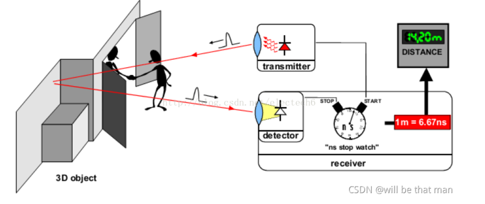

# ToF（Time-of-Flight）飞行时间测距技术

ToF 是一种测距技术，就像蝙蝠用超声波探测障碍物一样，它通过计算光线（通常是红外光）从发射到反射回来的时间，来测量物体的距离和深度信息。

## ToF 的工作原理

1. **发射光脉冲**：ToF 传感器会发射一束红外光（人眼不可见）。
2. **光线碰到物体并反射**：光遇到障碍物后，会反射回传感器。
3. **计算时间差**：传感器记录光从发射到返回的时间（Δt）。
4. **计算距离**：光速（c）是已知的（~3×10⁸ m/s），所以距离 d = (c × Δt) / 2。（除以 2 是因为光走了来回两段距离）

ToF 根据调制方法的不同，可以分为两种：脉冲调制（Pulsed Modulation）和连续波调制（Continuous Wave Modulation）。由于脉冲调制是直接测量飞行时间，因此也称为 **dToF**（直接 ToF）（LiDAR，也叫激光雷达，就是 dToF），连续波调制是通过相位差来计算飞行时间，因此也称为 **iToF**。

---

## ToF 的两种主要类型

### dToF（直接飞行时间，Direct Time-of-Flight）

- **原理**：直接测量光脉冲的往返时间。
- **优点**：
  - 测距远（可达几十米）
  - 抗干扰强，适合动态场景
  - 功耗低
- **缺点**：
  - 精度稍低（毫米级）
  - 硬件成本高
- **典型应用**：
  - 苹果 iPhone/iPad 的 LiDAR（激光雷达）
  - 自动驾驶汽车的远距离测距

### iToF（间接飞行时间，Indirect Time-of-Flight）

- **原理**：不直接测时间，而是通过测量反射光的相位差来计算距离。
- **优点**：
  - 精度高（可达亚毫米级）
  - 适合短距离（0.1~5 米）
  - 成本较低
- **缺点**：
  - 远距离性能差
  - 容易受环境光干扰
- **典型应用**：
  - 手机人脸识别（如华为、三星的 3D 面部解锁）
  - 扫地机器人避障
  - 手势识别（如微软 Kinect）

---

## ToF 的应用场景

| 领域 | 用途 |
|------|------|
| 智能手机 | 人脸解锁、AR 特效、背景虚化（如 iPhone 的 LiDAR 用于夜间对焦）|
| 自动驾驶 | 激光雷达（LiDAR）测距，构建 3D 环境地图 |
| 机器人 | 避障、导航（如扫地机器人）、物体抓取 |
| AR/VR | 手势交互、空间建模（如 Meta Quest 头显）|
| 工业检测 | 体积测量、缺陷检测、自动化分拣 |

---

## ToF vs. 其他深度传感技术

| 技术 | 原理 | 优点 | 缺点 |
|------|------|------|------|
| **ToF** | 测光飞行时间 | 速度快、适合动态场景 | 远距离精度稍低 |
| **结构光** | 投射光斑图案并分析形变 | 精度高（如 iPhone Face ID） | 易受强光干扰，测距短 |
| **双目视觉** | 双摄像头三角测距 | 成本低、无需主动光源 | 依赖纹理，暗光效果差 |

---

## 总结

- ToF 是一种通过光飞行时间来测距的技术，分为 **dToF**（远距离）和 **iToF**（高精度）。
- 应用广泛，从手机人脸识别到自动驾驶、机器人导航都在用。
- 比结构光更适合动态场景，比双目视觉更精准，但成本较高。
